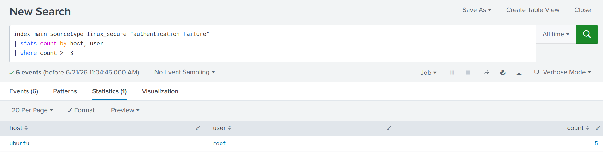

# Splunk Home Lab – Log Aggregation & Security Monitoring

## Project Overview

This project documents the deployment of a **Splunk-based home lab**, designed to simulate real-world log aggregation and security monitoring. The environment consists of a **Windows host running Splunk Enterprise**, an **Ubuntu virtual machine**, and a **pfSense virtual machine**. Logs from all three systems are centralized in Splunk, normalized using Technology Add-ons (TAs), and analyzed through custom SPL queries to simulate basic SOC monitoring and investigation workflows.

The primary goal was to gain hands-on experience with SIEM deployment, log forwarding mechanisms, data onboarding, log normalization, and basic security monitoring—skills essential for cybersecurity and SOC analyst roles.

---

## Lab Architecture

| Component                            | Purpose                                                                                   |
| ------------------------------------ | ----------------------------------------------------------------------------------------- |
| **Windows Host (Splunk Enterprise)** | Centralized SIEM platform installed directly on Windows; also forwards local Windows logs |
| **Ubuntu VM**                        | Linux endpoint generating authentication and system logs                                  |
| **pfSense VM**                       | Firewall/router generating firewall, DHCP, DNS, and system logs                           |
| **VirtualBox**                       | Hypervisor for managing Ubuntu and pfSense virtual machines                               |


## Tech Stack

| Component                          | Technology                 |
| ---------------------------------- | -------------------------- |
| **SIEM Platform**                  | Splunk Enterprise          |
| **Virtualization**                 | Oracle VirtualBox          |
| **Host OS**                        | Windows 10/11              |
| **Linux Endpoint**                 | Ubuntu                     |
| **Firewall**                       | pfSense Community Edition  |
| **Windows & Linux Log Forwarding** | Splunk Universal Forwarder |
| **Firewall Log Forwarding**        | Syslog (UDP 514)           |

---

## Setup & Configuration Steps

### 1. Virtual Lab Environment Setup

* Installed Oracle VirtualBox on the Windows host.
* Created an Ubuntu VM for Linux log generation.
* Created a pfSense VM to function as the firewall/router.
* Verified connectivity between all systems.

#### Network Modes Used

The lab used different VirtualBox networking modes depending on the testing scenario:

* **NAT Mode**

  * Used when forwarding Ubuntu logs to Splunk via Universal Forwarder.
  * Provides Internet connectivity for package installation, updates, and external communication.

* **Host-Only Mode**

  * Used when generating and monitoring pfSense firewall traffic.
  * Both Ubuntu and pfSense operated within an isolated lab network, allowing firewall events to be generated and analyzed without exposing the environment externally.

Networking modes were switched as needed to support both log forwarding and firewall monitoring use cases.

---

### 2. Splunk Enterprise Installation

* Installed Splunk Enterprise directly on the Windows host.
* Configured administrator credentials.
* Verified access through:

```text
http://localhost:8000
```

* Configured Splunk to receive forwarded data on port **9997**.

---

### 3. Windows Log Collection

Although Splunk Enterprise was installed locally on Windows, a Universal Forwarder was also deployed for learning purposes.

#### Logs Collected

* Security Event Logs
* System Event Logs
* Application Event Logs

#### Configuration

* Installed Splunk Universal Forwarder.
* Configured Windows Event Log inputs.
* Configured forwarding to:

```text
localhost:9997
```

* Verified events arriving in Splunk.

---

### 4. Ubuntu Log Collection

#### Logs Collected

```text
/var/log/auth.log
/var/log/syslog
```

#### Configuration

* Installed Splunk Universal Forwarder on Ubuntu.
* Configured monitoring of Linux log files.
* Configured forwarding to Splunk Enterprise on the Windows host.
* Verified events arriving in Splunk.

---

### 5. pfSense Log Collection

#### Configuration

In pfSense:

```text
Status → System Logs → Settings
```

Configured:

* Remote Syslog Enabled
* Windows Host IP as Syslog Destination
* UDP Port 514

Selected log categories:

* Firewall
* DHCP
* DNS Resolver
* System
* VPN

#### Splunk Configuration

* Configured UDP input on port **514**.
* Assigned sourcetype:

```text
pfsense
```

* Verified firewall logs were successfully ingested.

---

### 6. Technology Add-ons & Normalization

To normalize fields and map data to Splunk CIM standards, the following add-ons were installed:

#### Splunk Add-on for Unix and Linux

Used for:

* Linux authentication logs
* Linux system logs

#### Splunk Add-on for Microsoft Windows

Used for:

* Windows Event Logs
* Security auditing events

#### Technology Add-on for pfSense

Used for:

* Firewall logs
* DHCP logs
* DNS logs
* System logs

This add-on automatically transforms the generic `pfsense` sourcetype into specific sourcetypes such as:

```text
pfsense:filterlog
pfsense:dhcpd
pfsense:unbound
pfsense:openvpn
```

and extracts normalized fields such as:

```text
src_ip
dest_ip
action
transport
dest_port
```

---

## Splunk Queries

### Linux Authentication Failures

```spl
index=main sourcetype=linux_secure "authentication failure"
| stats count by host, user
| where count >= 3
```


**Purpose:** Detect multiple failed authentication attempts on Linux systems.

**Log Generation:** Multiple failed `sudo` authentication attempts were generated on the Ubuntu VM.

---

### Windows Account Creation & Privilege Escalation

```spl
index=main sourcetype=XmlWinEventLog (EventCode=4720 OR EventCode=4732)
| stats count by EventCode, SubjectUserName, TargetUserName, MemberName
```

**Purpose:** Detect user account creation and addition of users to the local Administrators group.

**Log Generation:**

```cmd
net user attacker Password123! /add
net localgroup Administrators attacker /add
```

---

### Windows Explicit Credential Usage

```spl
index=main sourcetype=XmlWinEventLog (EventCode=4648)
| table EventCode, action, dest, host, name, sourcetype, subject, user
```

**Purpose:** Detect attempts to use explicit credentials for authentication.

**Log Generation:**

```cmd
runas /user:attacker cmd
```

A password was supplied when prompted, generating Event ID 4648.

---

### pfSense Network Traffic Monitoring

```spl
index=main sourcetype=pfsense:filterlog
| stats count by src_ip, dest_ip, action
| sort - count
```


**Purpose:** Monitor network connections observed by the pfSense firewall.

**Log Generation:**

```bash
ping 8.8.8.8
```

```bash
nc -zv 192.168.56.1 22
```

```bash
curl http://example.com
```

These activities generated firewall events that were forwarded from pfSense to Splunk via Syslog and normalized using the pfSense Technology Add-on.

---

### Planned Screenshots

* Splunk Search Interface
* Windows Security Events (Event IDs 4720, 4732, 4648)
* Ubuntu Authentication Logs
* pfSense Firewall Logs
* pfSense Remote Syslog Configuration
* Parsed & Normalized Events

---

## Forwarder Configurations

### Windows Universal Forwarder – inputs.conf

```ini
[WinEventLog://Security]
disabled = 0
index = main
renderXml = true
start_from = oldest
current_only = 0

[WinEventLog://System]
disabled = 0
index = main
renderXml = true
start_from = oldest
current_only = 0
```

### Windows Universal Forwarder – outputs.conf

```ini
[tcpout]
defaultGroup = default-autolb-group

[tcpout:default-autolb-group]
server = 192.168.1.50:9997

[tcpout-server://192.168.1.50:9997]
```

### Ubuntu Universal Forwarder – inputs.conf

```ini
[monitor:///var/log/auth.log]
disabled = 0
index = main
sourcetype = linux_secure

[monitor:///var/log/syslog]
disabled = 0
index = main
sourcetype = syslog
```

### Ubuntu Universal Forwarder – outputs.conf

```ini
[tcpout]
defaultGroup = default-autolb-group

[tcpout:default-autolb-group]
server = 192.168.1.50:9997

[tcpout-server://192.168.1.50:9997]
```

**Note:** Windows and Ubuntu logs were forwarded to the Splunk Enterprise instance running on the Windows host (`192.168.1.50`) over TCP port `9997` using Splunk Universal Forwarders.

---

## Lessons Learned

* Deploying Splunk Enterprise in a virtualized environment
* Configuring Universal Forwarders on Windows and Linux
* Configuring Syslog ingestion from pfSense
* Troubleshooting log forwarding issues
* Installing and validating Splunk Technology Add-ons
* Normalizing heterogeneous log sources
* Creating SPL searches for authentication, endpoint, and network activity
* Understanding CIM-compliant field extraction and event enrichment

---

## Acknowledgements

* Splunk Documentation
* Splunk Community
* pfSense Documentation
* Ubuntu Documentation
* Cybersecurity and SOC Analyst Learning Communities

---

## Future Improvements

* Add a dedicated Kali Linux attacker VM
* Simulate SSH brute-force attacks
* Generate Nmap reconnaissance activity
* Build Splunk dashboards and alerts
* Create correlation searches across Windows, Linux, and pfSense logs
* Implement MITRE ATT&CK mappings for generated events
* Expand log sources with Sysmon and Zeek
